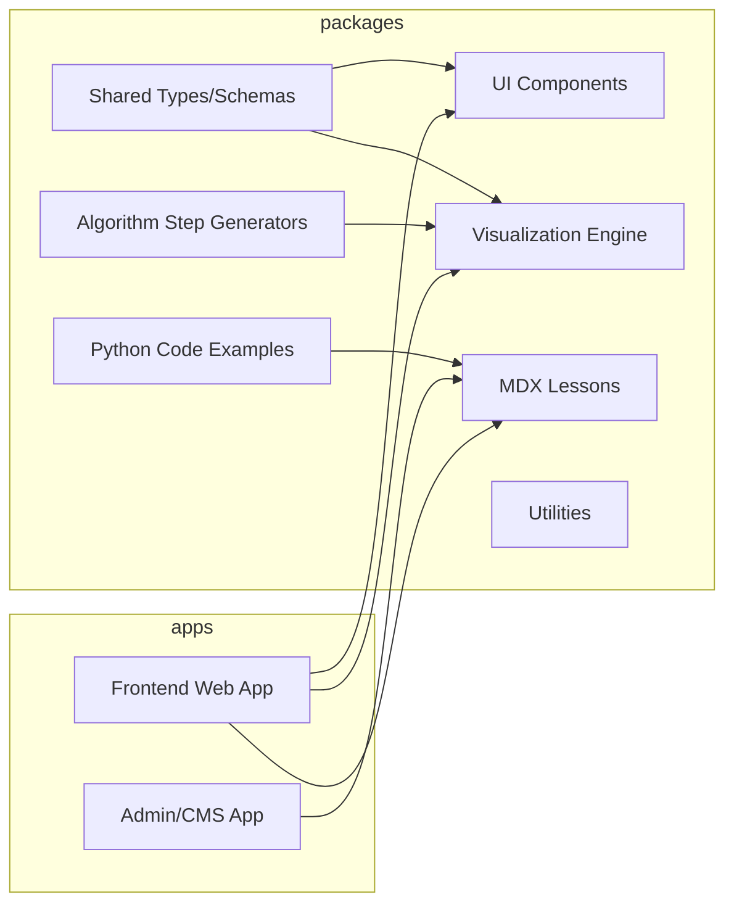
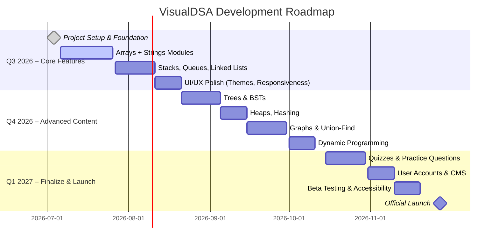

# Executive Summary  
We propose **VisualDSA**, an open-source interactive platform for learning data structures and algorithms. VisualDSA combines step-by-step SVG-based visualizations, Python code examples, explanatory walkthroughs, and practice exercises into a cohesive curriculum. Unlike existing tools (e.g. VisuAlgo or VisualizeDSA), VisualDSA will guide beginners through a structured learning path—covering fundamentals through advanced topics—with rich narrative and quizzes. Key differentiators include: a **Python-first** focus (so learners read idiomatic Python pseudocode), an emphasis on *why* and *how* (not just what), and alignment to real interview needs. The MVP will prioritize core value propositions: interactive algorithm animations (with play/pause/step controls), live complexity metrics, in-context explanations, and user progression tracking (profiles/bookmarks). Over ~6 months, we will build a Turborepo-based web app (Next.js + React + TS) plus a content backend or Python execution API, releasing incremental milestones (see Roadmap). Success will be measured by user engagement (time on site, repeat visits), learning outcomes (self-reported understanding), and adoption (stars, shares).  

# Product Vision  
VisualDSA’s vision is *“To make DSA intuitive, not intimidating.”* We will be **the interactive classroom for DSA**, targeting backend developers, students, and interviewees who prefer learning by doing. The platform teaches *why* algorithms work, not just showing them. It will be free, open-source, and community-driven, positioning the creator (you) as a thought leader in tech education.  

# Target Users / Personas  
- **Backend Engineer (mid-level):** Familiar with practical coding (Node.js, databases), wants to “finally get DSA for interviews” in a minimal time. Loves Python code examples. Wants bite-sized lessons and interactive demos to stay motivated.  
- **CS Student:** Has seen DSA in class but needs reinforcement. May struggle with textbook explanations. Prefers clear visualizations and hands-on practice. Likely to bookmark, revisit topics.  
- **Job-Seeker (self-taught):** Prepping for FAANG-like interviews. Has limited free time. Will use the platform to quickly revise core topics (sorting, searching, trees, graphs) and test understanding with quizzes.  

# Core Value Propositions  
- **Interactive Visualization:** Algorithms come alive with animated SVG diagrams (no static images). Users can control execution (play/pause/step) at their own pace.  
- **Python-Centric Code:** All pseudocode and examples are in Python, making the logic transparent. Annotations and line-by-line walkthroughs accompany each snippet to deepen comprehension.  
- **Explain-as-You-Go:** After each step, the platform explains what happened and why. E.g., “We moved the left pointer because the left value is less than the target” rather than just highlighting code.  
- **Structured Curriculum:** A clear learning path from basics (what is DSA, Big-O) up through advanced topics (DP, graphs), so learners never wonder “what to learn next.”  
- **Practice & Assessment:** Built-in quizzes and problems reinforce each topic. Spaced repetition ensures long-term retention (solve a problem, forget, then revisit later).  
- **Free & Open:** Entirely free, with no ads. Users can sign up for progress tracking (bookmarks, completion badges). An admin interface/CMS makes it easy to add new content.  

# MVP Features (Prioritized)  
1. **Core Visualizer Engine:** Render algorithm steps as SVG. Include playback controls (▶️▶️, pause, step, speed slider). Support highlighting and animations via Framer Motion.  
2. **Python Code Examples:** For each topic, show clear Python code. Include a toggle to view in other languages (optional). Provide line-by-line commentary for Python.  
3. **Explanations:** Text sections (“Theory”, “Why this algorithm?”, “Real-world use cases”). Interweave explanations with the visualization.  
4. **Learning Roadmap:** Organized topics/pages. E.g. Home → “Arrays” → subtopics.  Each topic page has Theory, Visualization, Code, Dry Run, Complexity, Common Mistakes, Practice, etc.  
5. **Quiz/Practice:** Short quizzes or interactive questions after each topic (e.g. “What happens next?” multiple-choice, or fill-in-the-blank). Provide feedback.  
6. **User Accounts:** Email/password login (or GitHub OAuth). Users can bookmark positions, mark topics done, track quiz scores. Also Admin role for adding/editing content in a simple CMS.  

*Table: MVP Feature Prioritization*  

| Feature                         | Description                                             | Priority |
|---------------------------------|---------------------------------------------------------|----------|
| Interactive Visualizer          | SVG-based step animations (with play/pause/step)         | ★★★★★    |
| Python Code + Walkthrough       | Python implementations of algorithms with line-comments  | ★★★★★    |
| Learning Path & Content Pages   | Structured curriculum (Foundations → DP)                | ★★★★★    |
| Explanatory Text and Examples   | “Why it works”, analogies, real-world use cases         | ★★★★☆    |
| Performance Metrics (Big-O)     | Real-time time/space complexity display                 | ★★★★☆    |
| Practice Problems / Quizzes     | Questions with hints after each topic                   | ★★★★☆    |
| User Profiles & Bookmarks       | Save progress, resume later                              | ★★★☆     |
| Admin CMS / Content Editing     | Interface to add topics/quizzes                         | ★★★☆     |
| Multi-language Support          | (Chinese/Indonesian) later                              | ★★☆☆☆    |
| Dark Mode / Theming             | UI polish                                               | ★★☆☆☆    |

# Competitor Audit  

We compare VisualDSA to leading platforms. This highlights gaps we can fill.

| Feature                       | **VisualizeDSA** (visualizedsa.com)           | **VisuAlgo** (visualgo.net)                       | **DSAVisualizer** (dsavisualizer.in)          | **AlgoFlow** (nextjs demo)                     |
|-------------------------------|-----------------------------------------------|--------------------------------------------------|-----------------------------------------------|-----------------------------------------------|
| **Interactive animations**    | ✔️ Step-by-step SVG animations    | ✔️ Animation + “e-lecture” slides    | ✔️ Step animations (marketing claim)         | ✔️ Custom animations (demo site) |
| **Playback controls**         | ✔️ Play/Pause/Step/Speed         | ✔️ Play/Pause/Step (keyboard shortcuts) | ✔️ Assumed (not explicit)                   | ✔️ Yes (demo states it)         |
| **Code examples**             | ✔️ C/C++/Java/Python/JS tabs     | ❌ No runnable code (some pseudo-code)           | ❓ Not clear                                | ✔️ Yes (Monaco)               |
| **Language focus**            | Python + others (multi-language) | Java/C++ (lectures)                              | Python? (implied by name)                    | (JS/TS)                                     |
| **Explanations**              | ✔️ Python walkthrough steps    | ✔️ Textual lecture (e-lecture mode)  | ✔️ Possibly tutorial content                | ✔️ Structured explanations (site) |
| **Complexity metrics**        | ✔️ Time/Space indicators (shown) | ✔️ Yes (slides)                                  | ✔️ Claim: shows Big-O (front page)           | ✔️ Covered in algorithms (demo)            |
| **Quiz/Practice**             | ❌ None                                        | ✔️ Online Quiz system (active)         | ❓ Might have practice                      | ⏳ Coming (AI hints)         |
| **Accounts/Progress**         | ❌ No                                          | ✔️ Accounts for NUS (login)         | ✔️ Login/Signup (site has it)               | ❌ Not implemented                        |
| **Learning roadmap**          | ❌ Flat list of algos                          | ❌ Not explicitly organized                       | ✔️ Shows categories (sorting, etc.)        | ✔️ Shows categories & filters |
| **Free**                      | ✔️ Free and open                               | ✔️ Free                                          | ✔️ Claimed free (ad-supported)             | ✔️ Free & open source                     |
| **Strengths**                 | Very clear Python walkthrough; modern UI      | Extensive content; quizzes; multilingual        | Positive user reviews, broad audience       | Modern stack (Next.js, Convex); AI vision   |
| **Gaps**                      | No quiz or assessments; lacks narrative       | Very academic style; steep UI; no Python focus   | Marketing focus; less technical depth       | Early-stage; incomplete features            |

- *Sources:* VisualizeDSA (interactive demos, code); VisuAlgo (24 modules + quiz); AlgoFlow announcement (features).

# Curriculum Outline  

We structure content in phases. Each phase has clear learning objectives and supporting features.

- **Phase 0: Foundations (Pre-DSA)**  
  *Objectives:* Understand what an algorithm and data structure are; why DSA matters. Grasp Big-O notation and recursion basics.  
  *Topics:*  
  - What is a data structure? What is an algorithm? (Simple analogies: organizing a closet, recipes)  
  - Why DSA is important (performance, interviews).  
  - Big-O time/space (motivate with growth charts; e.g. O(1), O(n), O(n²)).  
  - Recursion vs iteration (visualizing stack vs loops).  
  *UI Components:* Simplified graphs for time complexities; call-stack visualizer for recursion.  
  *Interactions:* Sliders to change input size and see runtime growth. Demo factorial or Fibonacci recursion tree.  
  *Sample Pseudocode:*  
  - Fibonacci (recursive vs tabulation)  
  - Example showing O(n) vs O(log n) with charts.

- **Phase 1: Arrays**  
  *Objectives:* Grasp contiguous memory, indexing, and basic ops (access, insert, delete) and their costs. Understand how sorted vs unsorted affects algorithms.  
  *UI:* Render an array as SVG boxes (with indices). Show pointer highlights (e.g. current index, left/right pointers).  
  *Interactions:*  
    - **Set input:** User enters or randomizes an array.  
    - **Pointers:** Two-pointer highlights (e.g. L and R).  
    - **Animations:** Show elements shifting when inserting/deleting.  
    - **Controls:** Play/Pause, step, speed.  
  *Sample Algorithms:*  
    1. **Linear Search:** Scan array sequentially.  
       ```python
       def linear_search(arr, target):
           for i, val in enumerate(arr):
               yield { "index": i, "message": f"Compare {val} to {target}" }
               if val == target:
                   yield { "found": i, "message": "Target found!" }
                   return i
           yield { "message": "Not found" }
       ```  
    2. **Binary Search (Sorted Array):** Divide-and-conquer search.  
       ```python
       def binary_search(arr, target):
           left, right = 0, len(arr)-1
           while left <= right:
               mid = (left + right) // 2
               yield { "left": left, "mid": mid, "right": right,
                       "message": f"Check middle index {mid} (value {arr[mid]})" }
               if arr[mid] == target:
                   yield { "found": mid, "message": "Target found." }
                   return mid
               if arr[mid] < target:
                   yield { "move": "left→", "message": "Discard left half" }
                   left = mid + 1
               else:
                   yield { "move": "→right", "message": "Discard right half" }
                   right = mid - 1
           yield { "message": "Not found" }
       ```  
    3. **Prefix Sum Array:** Compute running sums for range queries. Useful for sliding windows.  
       ```python
       def prefix_sum(arr):
           ps = [0]*(len(arr)+1)
           for i in range(len(arr)):
               ps[i+1] = ps[i] + arr[i]
               yield { "index": i, "ps": ps.copy(), "message": f"Sum up to index {i}: {ps[i+1]}" }
           return ps
       ```  
    4. **Two Pointers / Sliding Window:** E.g., find subarray sum, or remove duplicates.  
       ```python
       def two_pointers_sum(arr, target):
           left, right = 0, len(arr)-1
           while left < right:
               s = arr[left] + arr[right]
               yield { "left": left, "right": right, "sum": s,
                       "message": f"Compare {s} to {target}" }
               if s == target:
                   yield { "found": (left, right), "message": "Pair found." }
                   return (left,right)
               if s < target:
                   yield { "move": "left→", "message": "Increase sum by moving left pointer right" }
                   left += 1
               else:
                   yield { "move": "←right", "message": "Decrease sum by moving right pointer left" }
                   right -= 1
           yield { "message": "No pair found" }
       ```  
  *Complexity Focus:* Show time complexity curves (e.g. binary search O(log n) vs linear O(n)). VisualDSA should animate or graph how comparisons scale.  

- **Phase 2: Strings**  
  *Objectives:* Treat strings as character arrays. Learn basic operations (concatenation, slicing) and pattern-searching algorithms.  
  *UI:* Similar to arrays but with characters.  
  *Sample Algorithms:*  
    - **KMP Search:** (show partial match table and search process).  
    - **Palindrome Check (two pointers).**  
    - **Rabin-Karp rolling hash:** visualizing window hash.  
    - **Trie (prefix tree)** basics (see Phase on Trie).  

- **Phase 3: Linked Lists**  
  *Objectives:* Understand node-based lists (singly, doubly). Practice pointer manipulation.  
  *UI:* Represent nodes as boxes with “value | next-pointer”. Animate re-linking (e.g. reverse).  
  *Interactions:* Add/remove nodes via UI. Highlight pointer changes.  
  *Algorithms:*  
    - **Reverse List:** Re-point next references.  
       ```python
       def reverse_list(head):
           prev = None
           curr = head
           while curr:
               nxt = curr.next
               curr.next = prev
               yield { "curr": curr.val, "prev": (prev.val if prev else None),
                       "message": f"Reverse pointer: {curr.val}.next → {prev.val if prev else None}" }
               prev = curr
               curr = nxt
           yield { "head": prev.val, "message": "List reversed" }
       ```  
    - **Detect Cycle (Floyd’s):** Animate fast/slow pointers meeting.  
    - **Merge Two Lists:** Step through merging.  

- **Phase 4: Stack**  
  *Objectives:* LIFO behavior, applications (undo, recursion simulation).  
  *UI:* Stack as vertical array; push/pop animations.  
  *Algorithms/Applications:*  
    - **Balanced Parentheses:** Use stack to validate.  
    - **Next Greater Element:** Given list, use stack to find next greater.  

- **Phase 5: Queue**  
  *Objectives:* FIFO behavior, circular queue concept, deque.  
  *UI:* Queue as horizontal array with front/back indicators.  
  *Algorithms:*  
    - **BFS (on Trees/Graphs):** Step through queue processing.  
    - **Sliding Window:** Use deque to find max/min in sliding window.  
    - **Scheduler Simulation:** Visualize job queue.  

- **Phase 6: Hash Tables**  
  *Objectives:* Key-value lookup, collision handling.  
  *UI:* Visualize an array of buckets with chaining or open addressing.  
  *Algorithms:*  
    - **Two-Sum:** Demonstrate using a hash map (Python dict) to find complements.  
    - **Frequency Counting/Anagrams:** Show building map of counts, then sliding window anagram check.  

- **Phase 7: Trees (Binary Trees & BST)**  
  *Objectives:* Node/link structure, tree traversals, binary search trees.  
  *UI:* Tree drawn as nodes connected by lines. Interactive “tree builder” (user inputs nodes) or sample trees.  
  *Algorithms:*  
    - **Tree Traversals (DFS/BFS):** Animate preorder/inorder/postorder vs level order.  
    - **BST Insert/Search:** Show link updating for insert; illustrate search path down a BST.  
    - **LCA (Lowest Common Ancestor).**  
    - *UI Component:* Checkbox to toggle balanced view (BST vs not).  

- **Phase 8: Heaps (Priority Queue)**  
  *Objectives:* Array-based binary heap, operations.  
  *UI:* Show heap as both tree and array side-by-side. Animate “heapify” (swapping).  
  *Algorithms:*  
    - **Heap Insert/Extract:** Show bubble-up and sink-down.  
    - **Heap Sort:** Visualize building heap then extracting.  

- **Phase 9: Trie (Prefix Tree)**  
  *Objectives:* Multi-way tree for strings/prefixes.  
  *UI:* Trie drawn top-down; each edge labeled by a char.  
  *Algorithms:*  
    - **Insert/Search:** Show path followed by input word.  
    - **Autocomplete:** Given prefix, highlight all descendant words.  

- **Phase 10: Graphs**  
  *Objectives:* Graph representations (adj list/matrix), fundamental algorithms.  
  *UI:* Nodes with edges (force-directed or grid layout). Allow custom input edges.  
  *Algorithms:*  
    - **DFS/BFS (Graph):** Similar to tree but on generic graph.  
    - **Dijkstra’s Algorithm:** Step through updating distances (priority queue operations).  
    - **Topological Sort:** Animate in-degree counting and queue.  
    - **Union-Find:** Show merging sets and find with path compression (for connectivity).  

- **Phase 11: Union-Find (Disjoint Set)**  
  *Objectives:* Model of connectivity.  
  *UI:* Represent nodes in separate sets (color-coded) and union operations.  

- **Phase 12: Dynamic Programming**  
  *Objectives:* Overlapping subproblems, memoization vs tabulation.  
  *UI:* Show DP table or recursive call tree with memo hits.  
  *Algorithms:*  
    - **Fibonacci (with memo):** Compare naive vs memo.  
    - **Knapsack (0/1):** Fill DP matrix by decisions.  
    - **Longest Common Subsequence:** Fill table.  

- **Advanced Topics:** (for future phases) Segment Tree, Fenwick Tree, bit manipulation tricks, algorithm paradigms (greedy vs DP vs backtracking), algorithmic patterns (two-pointers, sliding window, etc.), and **Real-World Applications** (relate DS/algorithms to SQL indexes, caches, network graphs, etc.).  

*(For brevity, only key phases are expanded above. Each topic page will explicitly list its objectives, show UI components in wireframe form, and include interactive examples as described.)*  

# Technical Architecture  

Our stack will be a modern full-stack JavaScript monorepo (via **Turborepo** and pnpm). High-level structure:  



- **Frontend (apps/web):** Next.js + React + TypeScript.  
  - Uses **MDX** for content pages (lessons and explanations). MDX allows rich text (Markdown+React components) and easy code block inclusion.  
  - **UI Components (packages/ui):** Reusable React components styled with Tailwind CSS (buttons, modals, diagrams).  
  - **Visualizer (packages/visualizer):** Core logic that plays through algorithm steps. It renders states to SVG via React components (e.g. `<ArrayRenderer>`, `<GraphRenderer>`). It uses Framer Motion for animations (smooth transitions of SVG elements).  
  - **Algorithm Definitions (packages/algorithms):** Each algorithm is implemented as a generator that yields sequential “state” objects. For example, `bubbleSort(arr)` yields steps like `{array:[...], compared:[i,j], swapped:[i,j], message:"..."} `. This decouples logic from rendering.  
  - **Python Examples (packages/python-examples):** Python files (or AST) for each algorithm, which can be shown on-screen. These are static files imported for syntax highlighting.  
  - **State & Step Schema:** We define a common TypeScript interface:  
    ```ts
    interface Step {
      state: Record<string, any>;  // arbitrary state snapshot (e.g. array contents, indices)
      highlights?: string[];      // e.g. CSS ids to highlight
      message: string;            // explanation for this step
    }
    ```  
    Each algorithm generator returns `Generator<Step, void>` that the Visualizer engine will consume.  
  - **Renderer Contract:** For each data structure, we have a React component that knows how to draw the state fields. E.g.  
    ```tsx
    // Example renderer interface for arrays:
    type ArrayState = { array: number[], i?: number, j?: number, swapped?: [number,number] };
    function ArrayRenderer({state}: {state:ArrayState}) {
      return <svg> {state.array.map((val,k)=>(
        <g key={k}>
          <rect x={k*70} y={0} width={60} height={60} fill={state.i===k||state.j===k ? "yellow":"white"} />
          <text x={k*70+30} y={35} textAnchor="middle">{val}</text>
        </g>
      ))} </svg>;
    }
    ```  
    Similar renderers exist for LinkedList, TreeNode, Graph edges, etc. These components expose props like `x`, `y`, `color`, etc.  
  - **Animation/Player:** The Visualizer uses a simple controller. On “Play”, it iterates the generator with a timer (setInterval or requestAnimationFrame) adjusting speed. “Pause” stops the loop. “Next” calls `.next()` once. We will build a small controller around these `Step` objects for consistency. Framer Motion handles transitions (e.g. animating rectangle positions or colors).  

- **Backend (optional):**  
  - We may run a lightweight Python execution service for user-provided code (if allowing custom inputs). Options:  
    - **Pyodide (WebAssembly):** Run Python in-browser (no server needed). This could let users run small code snippets, but requires bundling Pyodide (size tradeoff).  
    - **Serverless Python:** A REST API (AWS Lambda/GCP Cloud Functions) that safely executes Python code. Must sandbox (no network/files). According to best practice, we would spin up an isolated container/VM per execution (no external access, limited RAM/CPU, and destroyed after use). This avoids the security pitfalls of running untrusted `exec()` in our server.  
    - For MVP, we may hardcode example inputs and not allow arbitrary code execution, to avoid complexity.  

- **Data Models:** (if accounts/quiz)  
  - *User* (id, email, hashed password, profile data).  
  - *Progress* (userID, topicID, completed boolean, bookmark, quiz scores).  
  - *Content* (topics, sections, quiz questions). We might use markdown/MDX for static content, or store in a simple headless CMS (JSON files or a DB). Admin can add via an interface.  

- **Tech Choices:**  
  - **Next.js** for routing and Markdown support. It’s fast and SEO-friendly.  
  - **TypeScript** for type safety across the codebase.  
  - **Tailwind CSS** for responsive styling.  
  - **Framer Motion** for animation (Declarative, works well with React).  
  - **MDX + remark** for lesson content (allows embedding React components within Markdown).  
  - **Shiki** for code syntax highlighting (precomputes highlighting at build time). This yields beautiful code blocks without client-side cost.  
  - **Monaco Editor** or **CodeMirror** for any embedded code-editing experiences (future scope). Monaco is powerful (used by VSCode) but heavier; CodeMirror 6 is lighter and highly modular.  
  - **Zustand** (or React Context) for global UI state if needed (e.g. current theme, user data).  
  - **D3.js** only for layout calculations (like tree or force-directed graph layouts), not for DOM manipulation. React will render all SVG. For example, D3 can compute x/y positions of tree nodes, then React draws circles/lines at those coordinates.  

- **CI/CD & Hosting:**  
  - **Version Control:** GitHub monorepo. Use GitHub Actions for linting, building, and tests.  
  - **Deployment:** Vercel or Netlify for the frontend (Next.js). They support monorepos and have preview URLs. For the (optional) Python service, we could use Vercel Functions or a Dockerized AWS Fargate/Lambda.  
  - **Testing:** Unit tests on the algorithms (e.g. Jest for TS code) and React components (RTL).  
  - **Performance:** Pre-render all static MDX pages. Code splitting for the visualizer. SVGs are lightweight, so performance should be good. We'll still aim for <1s initial load (cache content) and responsive 60fps animations for small n.  

- **Accessibility:**  
  - Use semantic HTML for controls (buttons with aria-labels).  
  - Ensure all actions (play/pause, step) have keyboard shortcuts (e.g. Space, arrows) as VisuAlgo does.  
  - Provide text alternatives (e.g. screenreader labels for SVG elements if needed).  
  - Use high-contrast colors and consider a dyslexic-friendly font toggle.  
  - Animations should run at a moderate speed by default with user control to adjust (avoids motion discomfort).  

- **Security / Sandboxing:** (if executing code) We adopt robust sandboxing: run code in a fresh, minimal container per execution (no external network/storage, limited memory/CPU). The server should strictly whitelist Python modules (no `os`, no `sys`, etc.). Even better, require building/executing code in a jailed environment or using Pyodide in-browser for a safe isolation.  

# UX Wireframes / Flow  

*We will start with low-fidelity wireframes.* For example, the **Algorithm Page** might look like:  

```plaintext
[Header: VisualDSA logo | Topic Nav | Login]  
Title: Binary Search (O(log n) / O(1) space)  

📖 Theory      🎬 Visualization      🐍 Python      ⚡ Complexity      📝 Common Mistakes      🎯 Practice  

-----------------------------------------------
|  ---------------        ---------------    |
| |  SVG Visualizer |      | Code Snippet |    |
| |  [ 0 1 2 3 4 ]  |      | def bs(arr,tgt):|   |
| | [L---M---R]     |      |   left=0...    |   |
|  ---------------        ---------------    |
|            | Play | ← [▶][⏸][⏭] Speed:1x     |
| Step Info: Compare arr[M] to target (hide)      |
-----------------------------------------------  
```

- The **Theory** tab explains the problem in simple language with examples.  
- **Visualization** shows the interactive SVG and controls.  
- **Python** tab shows code and a collapsible line-by-line explanation (like VisualizeDSA’s “Code Walkthrough”).  
- **Complexity** tab has a chart and analysis.  
- **Practice** has a prompt (“What happens next?”) or an embedded short problem.  

# Implementation Roadmap  

We'll follow Agile sprints with roughly one-month milestones, over ~6 months (Q3–Q4 2026). Example timeline:  



**Weekly Sprints:** Each week will have defined goals (e.g. “Implement binary search visualizer and its page layout”). We will hold a short demo at the end of each sprint.  

**Success Metrics:**  
- **Engagement:** Target 5–10K monthly active users within 6 months of launch, with average session ≥5 minutes (indicative of interactive learning).  
- **Learning Outcomes:** Measure quiz scores and repeat attempt rates (improving scores over time means learning).  
- **Quality:** >90% test coverage on algorithm code.  
- **User Feedback:** Collect NPS (Net Promoter Score) and user testimonials (via an optional quick survey).  
- **Technical:** Maintain Lighthouse scores ≥90 (performance/accessibility).  

# Libraries and Tools  

- **Front-End:** Next.js, React, TypeScript, Tailwind CSS, Framer Motion.  
- **Visualization:** SVG elements with React. Use **D3.js** only for layout (e.g. `d3.tree()` or force layouts to compute node positions). This keeps DOM manipulation in React.  
- **Syntax Highlighting:** **Shiki** (zero-runtime, VS Code themes).  
- **Editor:** Initially just code display; for any interactive coding, **Monaco Editor** (used in VSCode) offers excellent editing but is heavy. CodeMirror 6 is a lighter alternative.  
- **State Management:** React hooks or **Zustand** for simple global state (e.g. theme toggling, login state).  
- **Markdown/Content:** **MDX** for writing lessons and quizzes (allows embedding React components into Markdown).  
- **Auth:** Auth0 or Firebase Auth for quick user accounts (with JWTs).  
- **Backend (Python execution):** **Pyodide** for in-browser runs, or **Dockerized AWS Lambda** with secure sandboxing per [44].  
- **CI/CD:** GitHub Actions; Deploy on Vercel/Netlify.  
- **Analytics:** Google Analytics / Plausible to track usage.  

# Wireframes and Data Flow  

Below is a simplified data-flow diagram (Mermaid): 

```mermaid
flowchart TD
    User[User Browser] -->|HTTP/HTTPS| NextJSFrontend((Next.js App))
    NextJSFrontend --> Content["MDX Content (Lessons)"]
    NextJSFrontend --> VisualizerEngine
    VisualizerEngine --> Renderer[SVG Renderer (React Components)]
    VisualizerEngine -->|calls| AlgorithmGenerators[Algorithm Code (TypeScript/Py)]
    Renderer --> Display[DOM/SVG]
    User -->|interacts| Controls
    Controls --> VisualizerEngine
    VisualizerEngine --> PlaybackControls(Play/Pause/Step)
    %% Optional Python execution path
    PythonRunner((Pyodide or Service)) --> VisualizerEngine
    VisualizerEngine -->|runs| PythonRunner
    NextJSFrontend --> AuthService[Authentication API]
    NextJSFrontend -->|API| BackendDB[(User/Progress DB)]
```

This shows how a user’s browser (React frontend) fetches lesson content (MDX), runs the visualization engine (which processes algorithm state machines), and renders updates. User actions (play, step, speed) feed into the engine. An optional Python runner can supply algorithm code execution.  

# Conclusion  

VisualDSA will fill a gap in DSA education by aligning with how developers learn: hands-on, incremental, and explanatory. By building a robust visualization engine with a curriculum mapped to practical needs, we give learners an edge in interviews and real-world coding. This project leverages your strengths in full-stack development and combines AI-assisted study habits without outsourcing the learning: you implement each algorithm to truly understand it.  

**Sources:** We examined leading platforms (VisualizeDSA, VisuAlgo) and best-practice docs (Turborepo structure, secure code execution, arrays complexity, Shiki highlighting, keyboard accessibility) to inform this design.